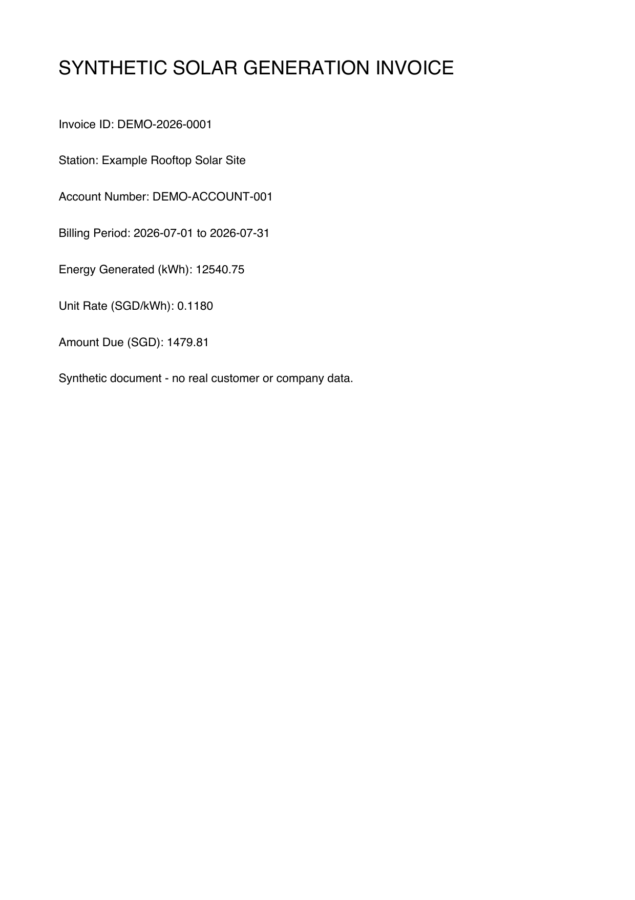

# Solar Invoice Document Intelligence Demo

A clean-room, privacy-safe portfolio project inspired by photovoltaic billing automation work. It uses only synthetic invoices and newly written code; no employer source code, station mapping, bill, account, or internal document is included.



## Demonstrated workflow

```text
synthetic PDF invoice
  -> text-layer extraction or Tesseract OCR fallback
  -> typed field parsing
  -> arithmetic QA and anomaly warnings
  -> JSON / batch CSV export
  -> FastAPI upload endpoint
```

## Quick start

```bash
python -m venv .venv
source .venv/bin/activate
pip install -e ".[dev]"
solar-invoice generate-demo
solar-invoice extract examples/synthetic_invoice.pdf
pytest -q
python scripts/benchmark_demo.py --runs 100
```

Batch export:

```bash
solar-invoice batch --input-dir examples --output ledger.csv
```

API:

```bash
uvicorn solar_invoice.api:app --reload
curl -F "file=@examples/synthetic_invoice.pdf;type=application/pdf" http://127.0.0.1:8000/extract
```

Interactive API documentation is available at `http://127.0.0.1:8000/docs`.

## Validation behavior

The parser extracts invoice ID, synthetic station name, account number, billing period, generated energy, unit rate, and amount due. It independently calculates `energy_kwh * unit_rate` and adds an `amount_mismatch` warning when the total differs.

The committed benchmark reports local parsing latency for a one-page synthetic text-layer PDF. It is an engineering measurement, not an OCR-accuracy or production-throughput claim.

## Honest scope

- The committed tests exercise both text-layer PDFs and image-only synthetic scans.
- Image-only PDFs are rendered and processed through a Tesseract OCR fallback, verified by an automated synthetic scan test.
- Production use would still require a representative, authorized evaluation set and OCR error analysis.
- The synthetic schema is generic and does not reproduce an employer document format.
- This repository is suitable for demonstrating document parsing, validation, API design, testing, and privacy-aware engineering—not production accuracy claims.
